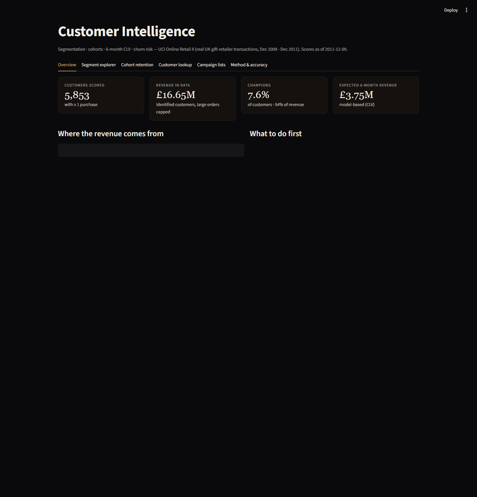
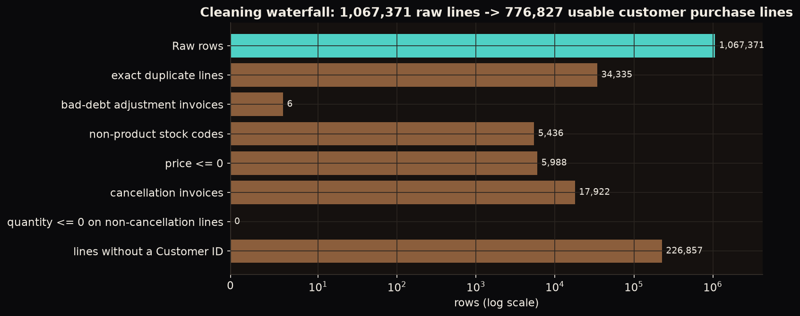
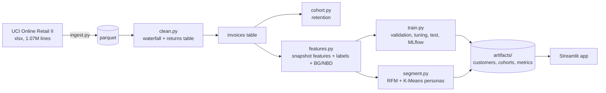
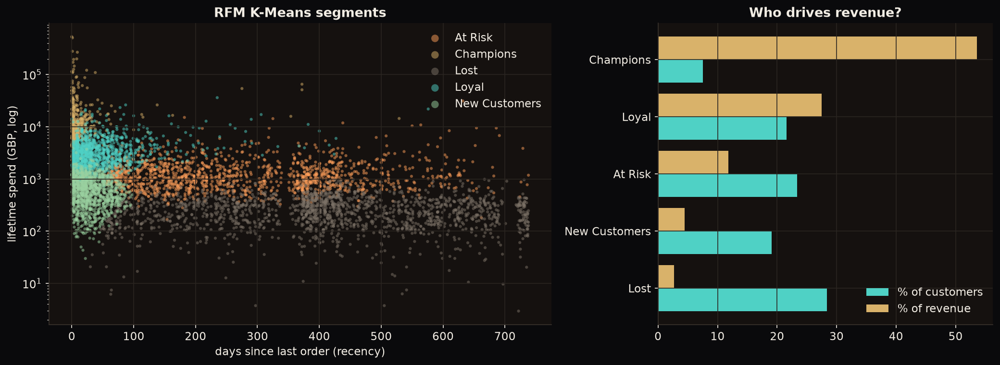
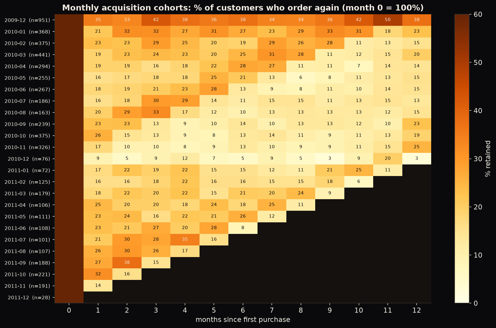
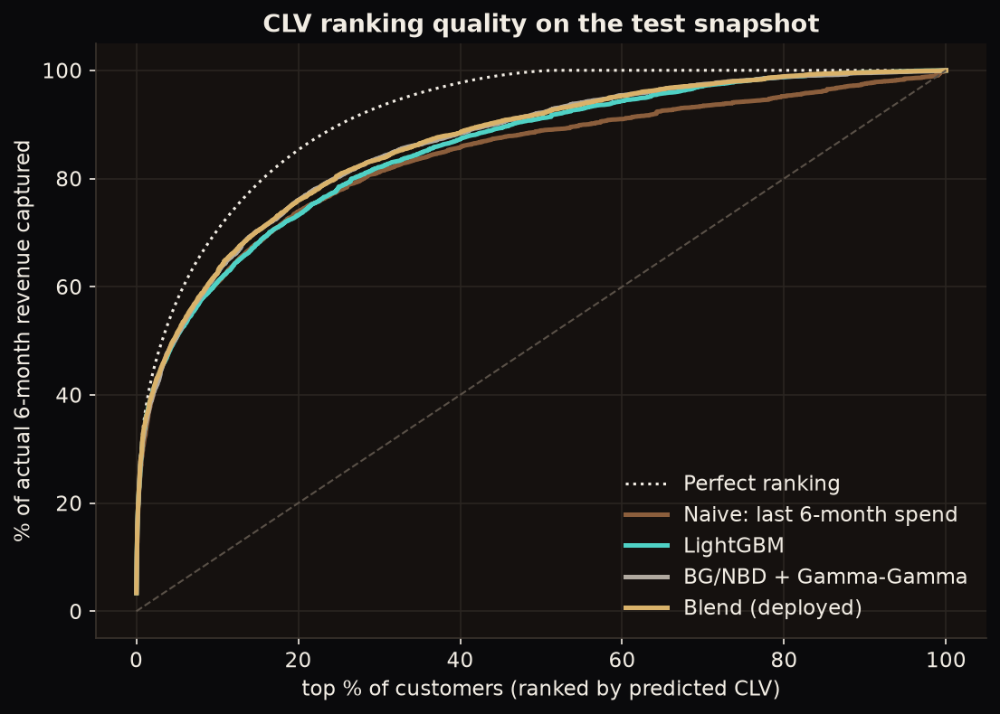

# E-Commerce Customer Intelligence: Segmentation, CLV & Churn Risk

Turns 1M raw invoice lines from a real UK online retailer into customer segments, 6-month customer-lifetime-value (CLV) estimates, churn-risk scores and ready-to-export campaign lists, delivered as an interactive Streamlit app.

**Live demo:** [https://ecommerce-customer-intelligence-gnheazzvqhklp9givzlygx.streamlit.app/](https://ecommerce-customer-intelligence-gnheazzvqhklp9givzlygx.streamlit.app/) · **Stack:** Python, DuckDB (SQL cohorts), BG/NBD (lifetimes), LightGBM, scikit-learn, SHAP, MLflow, Streamlit, GitHub Actions



## 1. Business problem

| | |
|---|---|
| **Stakeholder** | Head of marketing / CRM at an online gift retailer |
| **Decisions** | Who to protect, upsell or win back; who to stop spending on; which customers to contact first this month |
| **KPIs** | (1) Rank customers by next-6-month revenue: share of that revenue found in the top 10%; (2) flag customers who will not order again: ROC-AUC vs a simple "days since last order" rule; (3) segments a marketer can act on |

## 2. Data

**UCI Online Retail II** ([source](https://archive.ics.uci.edu/dataset/502/online+retail+ii), CC BY 4.0, no login): every invoice line of a UK online retailer selling giftware, 2009-12-01 → 2011-12-09, **1,067,371 rows**.

Real-world mess, handled and counted in `src/custintel/clean.py` (`artifacts/cleaning_report.json`):

| Step | Rows removed |
|---|---|
| Exact duplicate lines | 34,335 |
| Bad-debt adjustment invoices (`A…`) | 6 |
| Non-product codes (postage, fees, manual, samples) | 5,436 |
| Price ≤ 0 | 5,988 |
| Cancellations (`C…`) → moved to a returns table (used for return-rate features) | 17,922 |
| Lines without a Customer ID (22.8% of rows, **13.1% of revenue**) | 226,857 |
| **Usable customer purchase lines** | **776,827**: 5,853 customers, 36,600 orders |

Invoice revenue is capped at its 99.9th percentile (£14,180) for model targets: the largest single invoice is £168k.



## 3. Architecture



## 4. Approach

**Snapshot design (time-aware, no leakage).** A row is a *(customer, snapshot date)* pair. Features use only orders up to the snapshot; labels are what happens in the following **180 days**: revenue (CLV) and "no order at all" (churn). Snapshots are monthly.

* **Features (23):** recency, tenure, order count, order-days, spend, AOV and its variability, typical gap between orders, *overdue ratio* (recency ÷ typical gap), orders/spend in the last 30/90/180 days, spend trend, basket size, product variety, return rate, UK flag, share of Oct-Dec orders.
* **Models compared:** recency-only rule, "next 6 months = last 6 months" and lifetime-rate baselines, **BG/NBD + Gamma-Gamma** (probabilistic CLV), logistic regression, LightGBM (Tweedie objective for zero-inflated revenue), plus variants that stack the BG/NBD outputs as features, and a blend.
* **Cohorts:** monthly acquisition cohorts, retention by months since first order.
* **Segments:** K-Means (k = 5) on log-scaled recency/frequency/spend; personas named from cluster medians with explicit thresholds, so they are reproducible.
* **Tracking:** MLflow (local SQLite): pipeline run + 18 nested tuning trials.

**Evaluation protocol**

1. **Train:** 10 monthly snapshots, 2010-03 → 2010-12 (every label window ends by 2011-06-09).
2. **Model selection** on a separate validation snapshot (2010-12-09), fitting candidates only on snapshots whose labels end before it.
3. **Test:** snapshot **2011-06-09**, labels to 2011-12-09 (end of data). All candidates are scored and *all are reported*.
4. Hyper-parameters tuned with customer-grouped 5-fold CV on the training rows only.
5. Production scores as of 2011-12-09 refit on train + test snapshots.
6. Selection rule: *simplest candidate within 0.01 of the best validation score.*

## 5. Results

### Segments (as of 2011-12-09)

| Segment | Customers | % of customers | % of revenue | Median recency | Median orders | Avg churn risk |
|---|---|---|---|---|---|---|
| Champions | 442 | 7.6% | **53.6%** | 7 d | 24 | 6% |
| Loyal | 1,263 | 21.6% | 27.5% | 30 d | 9 | 17% |
| At Risk | 1,367 | 23.4% | 11.8% | 254 d | 4 | 53% |
| New Customers | 1,118 | 19.1% | 4.5% | 26 d | 2 | 38% |
| Lost | 1,663 | 28.4% | 2.7% | 413 d | 1 | 73% |



Actions per segment (Champions: reward, don't discount · Loyal: grow basket · New: push the 2nd order · At Risk: time-limited win-back · Lost: last-chance offer, then stop paying to reach them) are encoded in `segment.ACTIONS` and shown in the app.

### Cohorts

About 21% of a new cohort orders again in month 1 (IQR 17.5-23.5%). Cohorts acquired **Sep-Dec retain markedly worse** (averaged over months 1-6: 15% / 14% / 11% / 8% active per month vs ~20% for Jan-Aug cohorts), and Oct/Nov are also the largest intakes (375 / 326 customers vs ~240 typical): seasonal gift buyers.



### Churn: no order in the next 180 days (test snapshot, base rate 48.3%, n = 4,945)

| Model | ROC-AUC | PR-AUC | Top-decile churn rate | Lift |
|---|---|---|---|---|
| Rule: days since last order | 0.767 | 0.745 | 87.2% | 1.81 |
| BG/NBD (expected purchases) | 0.802 | 0.768 | 87.4% | 1.81 |
| **Logistic regression (deployed)** | **0.801** | 0.759 | 84.8% | 1.76 |
| LightGBM | 0.799 | 0.758 | 87.2% | 1.80 |

The deployed model beats the recency rule by **+0.034 AUC (95% CI +0.026 to +0.044, paired bootstrap over customers)** and is statistically indistinguishable from BG/NBD (−0.001, CI −0.007 to +0.005). Brier score 0.185. The predicted-vs-actual risk by decile is monotone but a bit under-confident at the top (0.74 predicted vs 0.85 actual).

### CLV: revenue in the next 180 days (test snapshot, actual total £4.19M)

| Model | Spearman | MAE £ | Top-10% revenue capture | Predicted total |
|---|---|---|---|---|
| Naive: last 6 months' spend | 0.568 | 539 | 60.8% | £3.05M |
| BG/NBD + Gamma-Gamma | 0.622 | 536 | 62.4% | £3.76M |
| LightGBM (base features) | 0.595 | 565 | 60.7% | £3.03M |
| LightGBM (+ BG/NBD & seasonal features) | 0.623 | 547 | 62.0% | £4.52M |
| **Blend of BG/NBD and LightGBM (deployed)** | **0.628** | **529** | 62.5% | £4.14M |



**The honest reading:** the top 10% of customers hold ~62% of the next 6 months' revenue, but the naive "same as last 6 months" rule already finds ~61%. Models add a small, statistically real edge (LightGBM base vs naive: +0.027 Spearman, CI +0.009 to +0.045), not a transformation. Use the scores to **prioritise** outreach, not to predict an individual's exact spend.

## 6. What went wrong along the way (kept in, because it matters)

* **First model selection failed on test.** I first picked the winner by *highest* validation score. It chose logistic regression with stacked BG/NBD features (validation AUC 0.7852 vs 0.7847 for the plain model: a tie) and on test it **collapsed to AUC 0.677**. Cause: BG/NBD is refit per snapshot and its parameters drift (on young snapshots the fit degenerates to a, b → 0), so the stacked features change meaning between snapshots; a linear model extrapolates on them, trees tolerate it. I replaced the rule with the parsimony rule above and kept the first run's metrics in `artifacts/metrics_run1_max_auc_selection.json`.
* **The rule-picked CLV model lost to BG/NBD on test** (LightGBM base: Spearman −0.026 vs BG/NBD, CI −0.039 to −0.015; and it under-predicts total revenue by 28%): the validation snapshot is a low-season window, the test snapshot a peak-season one, and the models rank differently in each. The deployed **blend was chosen after seeing the test snapshot**. It is a defensible way to handle conflicting evidence and it was within 0.006 of the best on validation, but it is *not* a clean pre-registered choice.
* **The test snapshot has therefore been scored twice.** Treat test numbers as mildly optimistic.
* **`lifetimes` bug:** with the fitted parameter a < 1 (typical for retail data) the library's expected-purchases formula divides by (a − 1) and returned `NaN` for ~14% of customers. I implemented the posterior expectation directly (λ integrated out analytically, dropout probability p on quantile nodes of its Beta prior), and a test checks it against `lifetimes` (P(alive) to 1e-6; expected purchases to 1e-9 wherever the library is defined).
* **Coefficient explanations were misleading.** Logistic-regression contributions on correlated RFM features gave odd per-customer signs ("more orders ⇒ more risk"), so the app shows transparent rule-based *risk signals* (e.g. "no order for 254 days; 3.6× longer than their usual gap") next to the score instead of pseudo-attributions.

## 7. Business value (assumptions labelled)

* **Concentration is measured, not assumed:** 442 Champions = 54% of revenue; 1,663 Lost customers = 2.7%.
* Preset **"Win-back: valuable and slipping"** (At Risk + Loyal, churn ≥ 50%, value-at-risk ≥ £100) selects 186 customers (3.2% of the base) with **£56,447 of "value at risk"**. *Value at risk = churn probability × the customer's typical 6-month spend (mean of the last two 6-month periods): a ranking heuristic, not a forecast of lost revenue.*
* *Illustration only, an assumption, not a result:* if a campaign recovered 10% of that value, the gain would be ~£5.6k per 6 months before campaign costs. Real uplift needs an A/B test, which this dataset cannot provide.

## 8. Limitations & next steps

* Two years of data = one seasonal cycle; a single UK retailer; 13% of revenue has no customer ID.
* One time-forward test snapshot (plus one validation snapshot), so differences between the top CLV models (≤ 0.03 Spearman) are within what regime change (low vs peak season) can flip.
* No causal estimate: predicted churn ≠ persuadable customers. Next step: uplift modelling from a randomised campaign.
* Data is historical (2009-2011); the app is a demonstration, not a live system.

## 9. Repository layout

```
src/custintel/   config, ingest, clean, cohort, features, btyd, models, segment, explain, train, report, viz
app/             Streamlit app (Overview, Segments, Cohorts, Customer lookup, Campaign lists, Method)
notebooks/       01_eda_cohorts_segments.ipynb, 02_modeling_clv_churn.ipynb (executed)
tests/           16 tests: cleaning rules, leakage guard, labels, BG/NBD vs lifetimes, personas, metrics
artifacts/       committed outputs the app reads (customers, cohorts, metrics), ~3 MB
reports/figures/ charts used here and on the portfolio
.github/workflows/ci.yml   ruff + pytest on every push
Dockerfile       container for the app
```

## 10. How to run

```bash
uv sync --all-groups && uv pip install -e .
uv run python -m custintel.ingest     # download UCI zip + convert the workbook (~5 min, one-off)
uv run python -m custintel.train      # clean, features, tuning, evaluation, scoring (~2 min)
uv run python -m custintel.report     # figures
uv run pytest -q && uv run ruff check .
uv run streamlit run app/streamlit_app.py
uv run mlflow ui --backend-store-uri sqlite:///mlflow.db
docker build -t customer-intelligence . && docker run -p 8501:8501 customer-intelligence
```

Deploy free on Streamlit Community Cloud: main file `app/streamlit_app.py`, dependencies from `requirements.txt` (the app only reads the committed `artifacts/`).

_Data: Chen, D. (2012). Online Retail II. UCI Machine Learning Repository, CC BY 4.0. Customer IDs are anonymised in the source._
